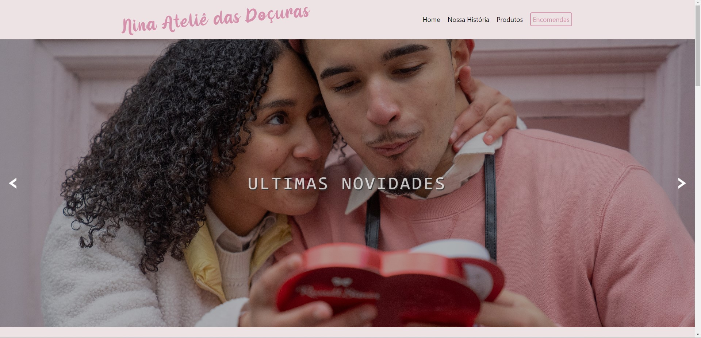
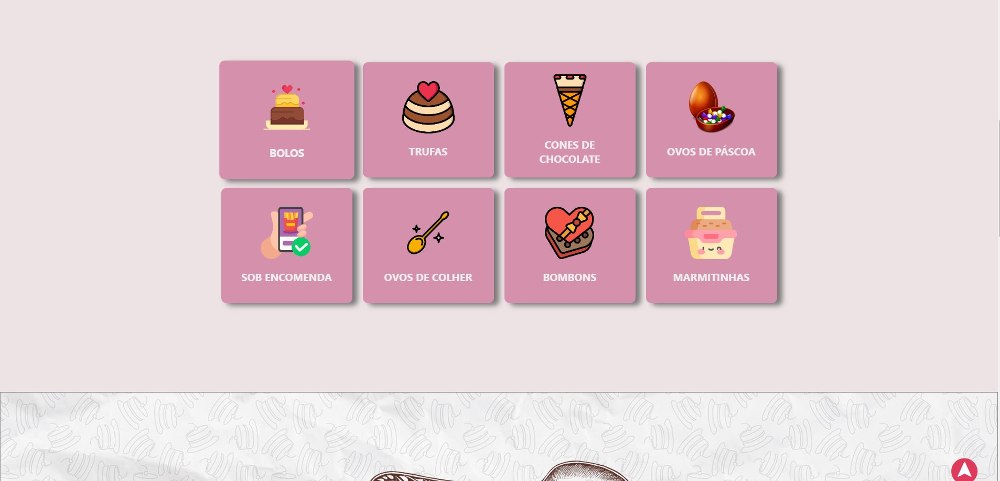
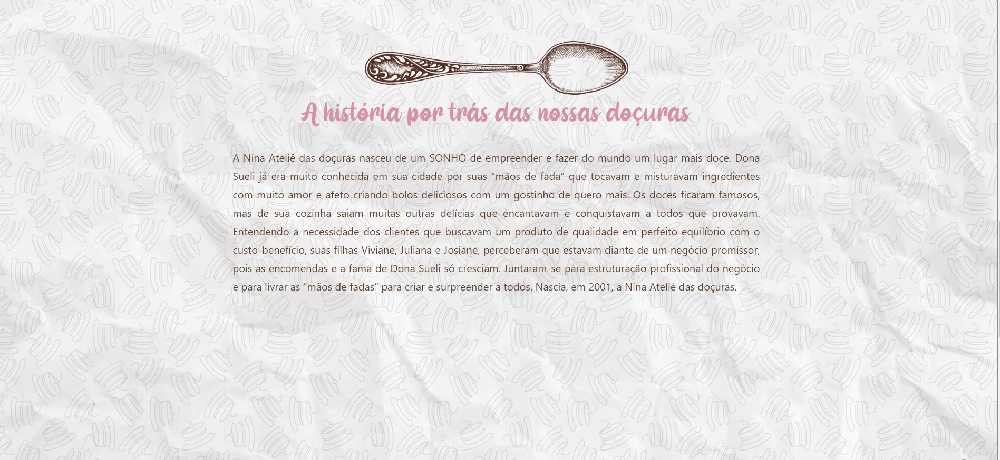
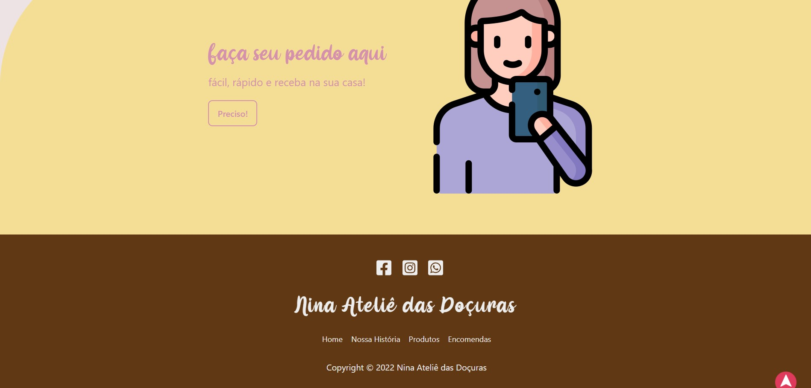

# Landing page Nina Ateliê das Doçuras

## Tabela do Conteudo
<ul>
<li><a href="#como-usar">Como usar</li>
<li><a href="#sobre">Sobre</a></li>
<li><a href="#status">Status</a></li>
<li><a href="#objetivo">Objetivo</a></li>
<li><a href="#curiosidade">Curiosidade</a></li>
<li><a href="#tenologias">Tecnologias</a></li>
<li><a href="#acessando-o-site">Acessando o site</a></li>
</ul>

## Como usar

Para utilizar os arquivos do projeto na sua maquina, você deve seguir os passos abaixos:

git clone- https://github.com/Lucaszanin/nina-atelie.git

cd pokedex 
npm install 
npm start

## Sobre

Projeto foi criado com o intuido de divulgar a marca Nina Ateliê das doçuras ,utilizando as tecnologias HTML, CSS e Javascript puro.

## Status

Projeto Nina Ateliê 🎯 concluido 👌

## Objetivo

O intuito do projeto foi aplicar os aprendizados de CSS Flexbox, html semântico , icones e fontes externas e javaScript puro. 
Todos os links de rede social estão funcionando e o projeto está 100% responsivo.

Alguns metodos utilizados no projeto:
HTML Semântico;
FlexBox;
Responsividade;
Manipulação do DOM;

## Curiosidade- Este projeto foi realizado para um grupo de amigas e ele é sem fins lucrativos.

## Tecnologias
<ul>
<li>HTML</li>
<li>CSS</li>
<li>JAVSCRIPT</li>
<li>GIT</li>
</ul>

## Acessando o site

Para acessar o site do projeto da Nina Ateliê das doçuras, por favor usar esse link : <a href="https://nina-atelie-aukhhvkvq-lucaszanin.vercel.app/" target="_blank">Nina Ateliê</a>